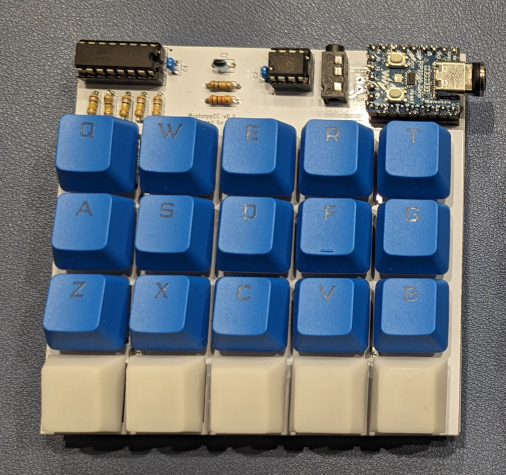

# PrototypEC

PrototypEC is a 4x5 EC keyboard.

## ビルドガイド
- [v0.2~](https://github.com/goropikari/PrototypEC/blob/v0.2/docs/build_guide.md)

[販売ページ](https://pikarikbd.booth.pm/items/5219024)

## License
- [`firmware`](./firmware): GNU General Public License v3.0
- the others: [Creative Commons Attribution 4.0 International License](https://creativecommons.org/licenses/by/4.0/)
