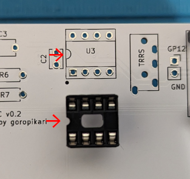
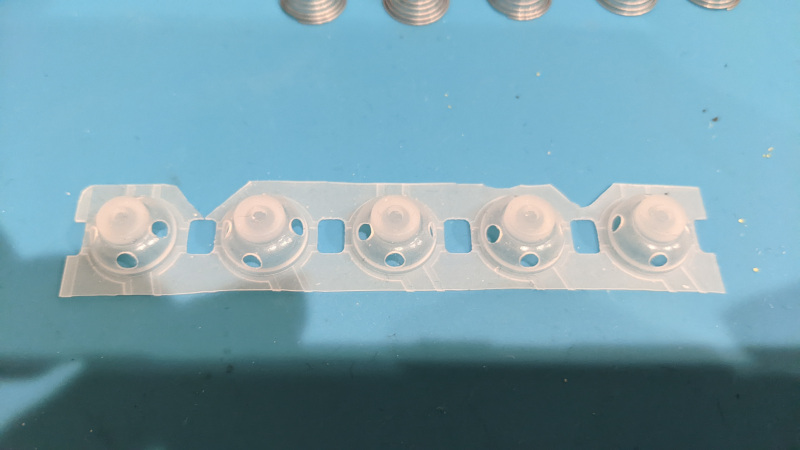

# PrototypEC Build Guide


## 部品
### キット同封物

| 名前                            | 数量 |
|---------------------------------|------|
| メインPCB                       | 1    |
| トッププレート                  | 1    |
| ボトムプレート                  | 1    |
| TRRS ジャック                   | 1    |
| マルチプレクサ (DIP-16)         | 1    |
| オペアンプ (DIP-8)              | 1    |
| 抵抗 100kΩ                      | 6    |
| 抵抗 1kΩ                        | 1    |
| コンデンサー 0.1uF              | 2    |
| コンデンサー 220pF              | 1    |
| IC ソケット DIP-16              | 1    |
| IC ソケット DIP-8               | 1    |
| pin socket 9pin                 | 2    |
| M2 スペーサー                   | 4    |
| M2 ネジ                         | 8    |
| M4 スペーサー                   | 4    |

### キット以外に必要なもの

| 名前                                                      | 数量 | 備考 |
|-----------------------------------------------------------|------|------|
| 静電容量式スイッチ                                        | 20   | 使用できるスイッチに関しては「[動作確認済みスイッチ](./switch.md)」をご参照ください |
| RP2040-zero                                               | 1    | - https://talpkeyboard.net/items/640ea9f3072c3c538731c515<br>- https://www.switch-science.com/products/7886 (switch science から購入した場合ピンヘッダーが付属されていないので別途 9pin のものを2つ用意してください)|
| USB C ケーブル(PC と接続用)                               | 1    | |
| TRS or TRRS ケーブル (分割キーボードとして使う場合)       | 1    | |


## 実装

基板の表裏は以下の写真のようです。


### ハンダ付け


パーツをハンダ付けしていきます。シルクに書かれた文字とパーツの対応は以下の通りです。

| シルクの文字 | 対応するパーツ      | 写真 |
|--------------|---------------------|------|
| R1~R6        | 抵抗 100kΩ          |      |
| R7           | 抵抗 1kΩ            |     |
| C1, C2       | コンデンサー 0.1 uF |      |
| C3           | コンデンサー 220 pF |      |
| U1           | RP2040-Zero         |      |
| U2           | マルチプレクサ      |      |
| U3           | オペアンプ          |      |
| TRRS         | TRRS ジャック       |      |

9pin ピンソケットを U1 のところにハンダ付けします。別途ご自身でコンスルー等を使用する場合や直接ハンダ付けする場合はピンソケットをハンダ付けする必要はありません。


IC ソケットをシルクに書かれた半円とソケットの半円状のくぼみの向きが合うようにハンダ付けします。ソケットの向きを間違えても機能上問題ありませんが後述の IC を差し込む際は向きに気をつけてください。





抵抗、コンデンサーを所定の位置にハンダ付けします。極性はないので向きはどちらでも構いません。

ハンダ付けが終わると下の写真のようになります。


rp2040-zero にピンヘッダーをハンダ付けします。下記写真の赤線で囲ったピンのみハンダ付けしてください。
ハンダ付けできたら rp2040-zero を差し込みます。ピンが長い場合は適宜短くカットしてください。


IC を 「IC の半円のくぼみ」と「ソケットの半円のくぼみ」が同じ向きになるように差し込みます。


### スイッチ

トッププレートに M2 スペーサーをネジで固定します。トッププレートに表裏はないためどちらの面からネジ止めしても大丈夫です。


次にハウジングをトッププレートに嵌めていきます。(使用するハウジングに応じた記述に従ってください。写真は [miniEC](https://github.com/goropikari/miniEC) のものですが方針は一緒です。)

#### NIZ のスイッチの場合

ハウジングを下図のような向きにプレートに嵌めていきます。(NiZ のハウジングの場合はあまり向きにシビアではありませんが、中央にくるように配置してください。)


ハウジングを全て嵌めたらプランジャーをハウジングに入れていきます。プランジャーはハウジングのレールに沿うように入れてください。

正しい向き<br>


間違った向き<br>


トッププレートの穴の大きさの影響でプランジャーの滑りが悪くなることがあります。その場合は穴をヤスリで削って拡張してください。


#### BTO のスイッチの場合

プランジャーに O リングを通し、プランジャーを嵌めます。プランジャーはハウジングのレールに沿うように入れてください。


ハウジングを下図のような向きにプレートに嵌めていきます。爪が引っかかる向きに注意してください。(穴のサイズ的に間違った向きにはそもそもハマりません)


トッププレートの穴の大きさの影響でプランジャーの滑りが悪くなることがあります。その場合は穴をヤスリで削って拡張してください。


#### 東プレスイッチ(Realforce) の場合

Realforce を分解しハウジング等を入手します。
ハウジングを下図のような向きにプレートに嵌めていきます。爪が引っかかる向きに注意してください。(穴のサイズ的に間違った向きにはそもそもハマりません)


トッププレートの穴の大きさの影響でプランジャーの滑りが悪くなることがあります。その場合は穴をヤスリで削って拡張してください。


#### すべてのスイッチ共通

BTO の[静電容量ラバーシート](https://btoshop.jp/products/adelcpru?_pos=1&_sid=2198dd0a1&_ss=r)のようなフルサイズのキーボード用のラバーシートを使う場合は5スイッチ分ずつ4行分ずつハサミで切り出します。
片手分の切り出し方の例として下の写真の赤線で囲った部分のように切り出すのがおすすめです。
全てを1スイッチ分ずつ切り分けたほうが後述する穴あけがやりやすいですが、コニカルスプリングがずれやすくなるのでまとめて切り出したほうが入力が安定します。


(オプション) ラバーシートの側面に穴を開けると打鍵が軽くなります。一方でタクタイル感が減りリニアに違い打鍵感になります。



切り出したラバーシートをスイッチに乗せ、コニカルスプリングを1つずつ配置します。コニカルスプリングは重なりやすいので1つずつになっていることを確認しながら配置してください。重なっていた場合入力がおかしくなることがあります。この時テーブルに直置きした状態で作業するとうまくハメられないため基板を浮かせた状態にしてください。
名刺やカードの短辺がおおよそ3キー分くらいの長さなのでプラスチック製のカードケースなどが使えると思います。
この作業のためだけの[スタンドの 3D モデルも用意](model/stand.stl)しているため 3D プリンターを所有されている方は印刷して使用してみてください。


### メイン基板・ボトムプレート・ゴム足

メイン基板を乗せ、スペーサーのところに M4 スペーサーをおいてください。トッププレートに上下はないのでメイン基板を乗せる際は穴の位置があっていればよいです。
最後にボトムプレートをかぶせネジで止め、ゴム足を貼り付けてください。
ハンダ付けした箇所が出っ張ってボトムプレートと干渉する場合はニッパーで適宜切ってください。


## Firmware

RP2040-Zero 用の CircuitPython を[ダウンロード](https://circuitpython.org/board/waveshare_rp2040_zero/)します。
(動作確認は [version 8.2.7](https://adafruit-circuit-python.s3.amazonaws.com/bin/waveshare_rp2040_zero/en_US/adafruit-circuitpython-waveshare_rp2040_zero-en_US-8.2.7.uf2) で行いました。)


BOOT ボタンを押しながら PC とつなげ、マウントされたストレージにダウンロードした `uf2` ファイルをコピーします。
- circuit python インストール方法
  - https://learn.adafruit.com/welcome-to-circuitpython/installing-circuitpython#bootloader-mode-3105160

コピーし終わると `CIRCUITPY` という名前でストレージがマウントされます。
分割キーボードとして使う場合は、ストレージ名を左手用のマイコンは `NYQUISTL`, 右手用は `NYQUISTR` にリネームしておいてください。**リネームを行わないと分割キーボードとして機能しません**。
- リネームの仕方
  - https://learn.adafruit.com/welcome-to-circuitpython/renaming-circuitpy

片手キーボードとして使う場合はリネームしなくて良いです。


次にマウントされたストレージに firmware プログラムを配置します。

```bash
git clone -b v0.2 --recursive https://github.com/goropikari/PrototypEC
```

`kmk_firmware` ディレクトリ配下の `kmk` ディレクトリをまるごとストレージ直下に配置します。

片手キーボードとして使う場合は [`firmware/one_hand`](./firmware/one_hand) ディレクトリ配下の Python プログラムをストレージ直下に配置します。

分割キーボードとして使う場合は [`firmware/split`](./firmware/split) ディレクトリ配下の Python プログラムをストレージ直下に配置します。左右それぞれの RP2040-Zero に同じプログラムを配置してください。


全てのファイルを配置したあとは以下のようなディレクトリ構成になります。

```bash
.
├── boot.py
├── code.py
├── kmk/
├── scanner.py
└── settings.toml
```


一度 USB ケーブルを抜き再度接続してください。このときはストレージとしてマウントされません。分割キーボードとして使う場合は USB ケーブルは左右どちらに接続しても構いません。
タイピングしてみてキーが入力されたら成功です。

### キーマップ変更

USB ケーブルを抜き、`GP12`, `GND` と書かれた部分をピンセットなどでショートさせながら USB ケーブルをつなぐと再びストレージとして認識されます。`code.py` を修正してお好みのキーマップにしてください。


※ シルクには GP12 と書かれていますがこれは間違えてしまっており、実際は RP2040-Zero の GP26 pin が引き出されています。firmware に手を加える場合はお気をつけください。


### 閾値調整

`settings.py` で `DEBUG=0` になっている部分を `DEBUG=1` にし、USB ケーブルを抜き差しすると各スイッチの電圧が出力されるようになります。**このときはキーを押しても何も入力されません。**

出力は [picocom](https://wiki.archlinux.jp/index.php/%E3%82%B7%E3%83%AA%E3%82%A2%E3%83%AB%E3%82%B3%E3%83%B3%E3%82%BD%E3%83%BC%E3%83%AB#picocom) や [Mu editor](https://codewith.mu/) を使うと見ることが出来ます。下図は Mu editor を使って出力値をプロットしているところです。


この出力値を参考に閾値を調節してください。初期値は下記のように設定されています。分割キーボードとして使用している場合は、調整は左右それぞれで行います。

```python
low_threshold=1.7,
high_threshold=2,
```

ここで `high_threshold`, `low_threshold` は [tomsmalley/custom-topre-guide](https://github.com/tomsmalley/custom-topre-guide/blob/c4a8cadadc9f8ab422d9cba28a28701198a1bd22/README.md#overview) における Actuation Depth, Release Depth にそれぞれ対応します。
簡単に言うとある電圧(high_threshold)よりも上ならばキーが押された、ある電圧(low_threshold)よりも下ならばキーが押されていないと判定しています。


## firmware をバグらせたら

キーマップやその他設定をいじっているとバグらせてしまうことが多々あります。その結果コードの書き換えが一切出来ない状態になることがあります。そのようなときは下記の記事を参考にマイコンを初期状態にリセットしてみてください。

https://zenn.dev/link/comments/c6600bde683fe6

## KMK firmware documentation

KMK Firmware の website で書かれている記述は PrototypEC で使われているものよりも新しくなっている可能性があります。
PrototypEC で使用している KMK Firmware の doc はこちらをご覧ください。
https://github.com/KMKfw/kmk_firmware/tree/2704432f7fe144960e210dc71fc005e5d23b202a
