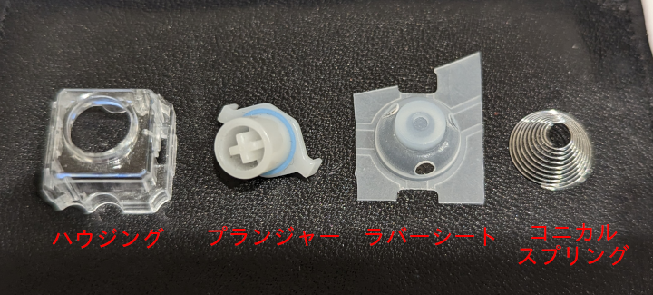

# 動作確認済みスイッチ

一般的なメカニカルスイッチと異なり静電容量無接点方式スイッチは構成パーツが別々で販売されております。
基本的なパーツはハウジング、プランジャー、コニカルスプリング、ラバーシートの4点から構成されます。
ハウジングとプランジャーは適合する組み合わせでないといけませんが、コニカルスプリング・ラバーシートはどれを選んでも問題ないように思えます(全ての組み合わせを試したわけではないので保証はしません)。

ここでは実際に動作することが確認できた組み合わせ例を紹介します。
なお便宜上、NIZ スイッチや BTO スイッチなどと書いていますがハウジングがそのメーカーのものというだけで全てのパーツのメーカーを揃えているわけではないので注意してください。静電容量無接点方式スイッチの場合、メカニカルスイッチでいうところのキメラスイッチは珍しくありません。

## NIZ スイッチ

NIZ はハウジング、プランジャー、ラバーシートは販売していますがコニカルスプリングは単独で販売していないため他のメーカー製のものを組み合わせる必要があります。またラバーシートは日本国内のショップでは取り扱いがないため NIZ 本家のサイトから購入し輸入する必要があります。

私が実際に試した構成は以下のようなものです。(全て遊舎工房で購入。2023/11/11 現在は全て在庫切れとなっており長らく在庫切れの状態が続いているため今後取り扱いはされないかもしれません。)
- [NEW NIZ EC SWITCH](https://shop.yushakobo.jp/products/5224?variant=44218541080807)
  - ハウジング・プランジャーのセットです
- [静電容量式キーボード用円錐バネ （30個）](https://shop.yushakobo.jp/products/4679?variant=43877011095783)
  - コニカルスプリング
- [静電容量ラバーシート](https://shop.yushakobo.jp/products/a0500er-01-1?variant=37665368080545)
  - ラバーシート

私は実際には購入していませんが beekeeb でセットで購入できるようです。 
https://shop.beekeeb.com/product/niz-ec-switch/

## BTO(Bit Trade One) スイッチ

- [ADELCPS 静電容量スイッチ4点セット10組 ](https://btoshop.jp/products/adelcps?_pos=1&_sid=e6a17b2ee&_ss=r)
  - ハウジング、プランジャー、コニカルスプリングのセットです
- [静電容量ラバーシート](https://btoshop.jp/products/adelcpru?_pos=1&_sid=45ca45893&_ss=r)
  - ラバーシート

## AliExpress で販売している謎のスイッチ

- [ハウジング](https://ja.aliexpress.com/item/1005005724051113.html?spm=a2g0o.order_list.order_list_main.90.a2e4585alQMddh&gatewayAdapt=glo2jpn)
- [プランジャー](https://ja.aliexpress.com/item/1005005721976294.html?spm=a2g0o.order_list.order_list_main.91.a2e4585alQMddh&gatewayAdapt=glo2jpn)
- [ラバーシート](https://ja.aliexpress.com/item/1005005721050116.html?spm=a2g0o.order_list.order_list_main.89.a2e4585alQMddh&gatewayAdapt=glo2jpn)
- [コニカルスプリング](https://ja.aliexpress.com/item/1005005879335153.html?spm=a2g0o.order_list.order_list_main.95.a2e4585alQMddh&gatewayAdapt=glo2jpn)

## 東プレスイッチ

東プレスイッチは個別で販売していないため Realforce を分解してパーツ取りします。
全てのモデルで分解できるのかわかりませんが、[Realforce 108UBK SJ08B0](https://www.realforce.co.jp/products/discontinued/108UBK_SJ08B0/) が分解できることは確認しています。
